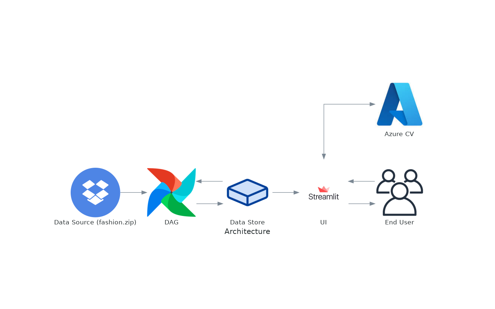

# Assignment3

## Technical stack
[](https://airflow.apache.org/)


[](https://github.com/)
[](https://github.com/features/actions)
[](https://www.python.org/)
[](https://streamlit.io/)

## Link to the Live Applications
* [Streamlit](http://35.211.154.219:8090/)
* [Codelabs](https://codelabs-preview.appspot.com/?file_id=1Xm0_C4J_oDYF_AqTcTQ3F07brDOWb9-vMEsGfFzEja0#0)

## Architecture

Following is the architecture diagram for the current application


## Running the application
### Pre-requisites
- [Docker Engine](https://docs.docker.com/engine/install/)
- [Docker compose](https://docs.docker.com/compose/install/)

### Steps to run application locally
1. Clone the repository
    ```bash
        git clone https://github.com/BigDataIA-Summer2023-Team2/Assignment3.git
    ```
1. Create an environment file with following variables defined
    ```bash
        azure_cv_key="xxx"
        azure_cv_endpoint="xxx"
        DATA_DIR="/data"
        AIRFLOW_UID=xxx
    ```
1. Run the make command to build and deploy the application
    ```bash
        make build-up
    ```
1. Applciation would be accessible on localhost at following URLs \
    **Streamlit:** http://localhost:8090/ \
    **Airflow:** http://localhost:8080/ *Credentials - username: airflow; password: airflow*
1. Destroying the deployed environment
    ```bash
        make down
    ```
## Project Tree

```
.
├── Makefile
├── README.md
├── airflow
│   ├── Dockerfile
│   ├── dags
│   │   ├── embeddings.py
│   │   └── utils
│   │       ├── __init__.py
│   │       └── azure.py
│   └── requirements.txt
├── case_study
│   ├── 01 Fashion visual search - Images analysis.ipynb
│   ├── 02_Fashion_visual search_Images_embeddings.ipynb
│   ├── 03_Fashion_visual_search_Search_using_an_image_or_a_prompt.ipynb
│   ├── 04_Fashion_visual_search_Images_Clustering.ipynb
│   ├── 05_Fashion_visual_search_Gradio_App.ipynb
│   ├── azure.env
│   ├── azure.py
│   ├── images
│   │   ├── embeddings.jpg
│   │   ├── fashionheader.png
│   │   ├── fashionprocess.png
│   │   ├── florence.jpg
│   │   ├── map1.png
│   │   ├── map2.png
│   │   ├── umap1.png
│   │   ├── umap2.png
│   │   ├── umap3.png
│   │   ├── umap4.png
│   │   ├── webapp1.jpg
│   │   └── webapp2.jpg
│   ├── requirements.txt
│   └── test
│       ├── test1.jpg
│       ├── test2.jpg
│       ├── test3.jpg
│       ├── test4.jpg
│       ├── test5.jpg
│       └── test6.jpg
├── diagrams
│   ├── architecture.png
│   ├── architecture.py
│   ├── requirements.txt
│   └── resources
│       ├── azure.jpg
│       ├── dropbox.png
│       └── streamlit.jpg
├── docker-compose-local.yml
└── streamlit
    ├── Dockerfile
    ├── Home.py
    ├── pages
    │   ├── 1_Image_Analysis.py
    │   ├── 2_Image_Search.py
    │   ├── 3_Image_Clustering.py
    │   └── 4_Inventory_Analysis.py
    ├── requirements.txt
    └── utils
        ├── __init__.py
        ├── analysis.py
        ├── azure.py
        ├── cluster.py
        ├── plots.py
        └── search.py
```
## References
- [Streamlit](https://streamlit.io/)
- [Azure Computer Vision](https://azure.microsoft.com/en-us/products/cognitive-services/vision-services)
- [Azure Computer Vision workshop](https://github.com/Azure/gen-cv)
- [Fashion Image Dataset](https://www.dropbox.com/s/f5983zo3etaqap9/fashion_samples.zip)

## Team
| Contributor    | Contibutions |
| -------- | ------- |
| Ashritha Goramane  | -            |
| Rishabh Indoria    | -            |
| Parvati Sohani     | -            |

Guided by: Prof. Srikanth Krishnamurthy
Supported by: [Piyush](https://github.com/piyush-an)
